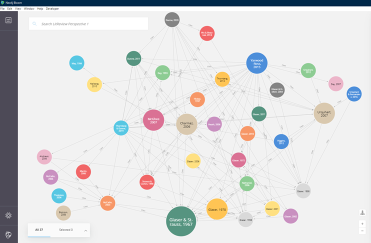

# literature-in-GT
Citation links for discussions of literature reviews in Grounded Theory.

## The purpose 

The use of literature in grounded theory studies has been a topic of debate for over 40 years. The Cypher script in this project can be used to quickly identify the main sources and add new ones. This will be helpful to other students and researchers by giving them a headstart on identifying the key sources.

Cypher Reference	Title	Publication	Reference
  (`1` :`Glaser, 2006` ) ,	The Roots of Grounded Theory	The Grounded Theory Review	(Glaser 2006)
  (`2` :`McCallin, 2006` ) ,	Methodological Issues: Have we forgotten the place of thinking here?	The Grounded Theory Review	(McCallin 2006)
  (`3` :`McCallin, 2003` ) ,	Grappling with the literature in a grounded theory study	Contemporary Nurse	(McCallin 2003)
  (`4` :`Thulesius, 2006` ) ,	New Way of Using Literature in GT	The Grounded Theory Review	(Thulesius 2006)
  (`5` :`Martin, 2006` ) ,	The relationship between an emerging grounded theory and the existing literature: Four phases for consideration	The Grounded Theory Review	(Martin 2006)
  (`6` :`Ekstrom, 2006` ) ,	Aspects on McCallin’s paper,“Grappling with the literature in a grounded theory study”	The Grounded Theory Review	(Ekstrom 2006)
  (`7` :`Nathaniel, 2006` ) ,	Thoughts on the literature review and GT	The Grounded Theory Review	(Nathaniel 2006)
  (`8` :`Andrews, 2006` ) ,	The literature review in grounded theory: A response to McCallin (2003)	The Grounded Theory Review	(Andrew 2006)
  (`9` :`Yarwood-Ross, 2015` ) ,	Using extant literature in a grounded theory study: a personal account	Nurse Researcher	(Yarwood-Ross and Jack 2015)
  (`10` :`Thornberg, 2012` ) ,	Informed Grounded Theory	Scandinavian Journal of Educational Research	(Thornberg 2012)
  (`11` :`McGhee 2007` ) ,	Grounded theory research: literature reviewing and reflexivity	Journal of Advanced Nursing	(McGhee, Marland et al. 2007)
  (`12` :`Dunne, 2011` ) ,	The place of the literature review in grounded theory research	International Journal of Social Research Methodology	(Dunne 2011)
  (`13` :`Dunne, 2020` ) ,	Successfully Managing the Literature Review and Write-up Process When Using Grounded Theory Methodology—A Dialogue in Exploration	Forum Qualitative Sozialforschung/Forum: Qualitative Social Research	(Dunne and Ustundag 2020)
  (`14` :`Glaser, 1998` ) ,	Doing Grounded Theory: Issues and Discussions	Sociology Press	(Glaser 1998)
  (`15` :`Glaser, 2001` ) ,	The Grounded Theory Perspective: Conceptualization Contrasted with Description	Sociology Press	(Glaser 2001)
  (`16` :`Glaser, 2002` ) ,	Constructivist grounded theory?.	Forum Qualitative Sozialforschung/Forum: Qualitative Social Research	(Glaser 2002)
  (`17` :`Glaser, 2010` ) ,	The future of grounded theory.	The Grounded Theory Review	(Glaser 2010)
  (`18` :`Thornberg & Dunne, 2019` ) ,	Literature review in grounded theory.	Sage	(Thornberg and Dunne 2019)
  (`19` :`Wu & Beaunae, 2014` ) ,	Personal reflections on cautions and considerations for navigating the path of grounded theory doctoral theses and dissertations: A long walk through a dark forest		(Wu and Beaunae 2014)
  (`20` :`Charmaz, 2006` ) ,	Constructing grounded theory: A practical guide through qualitative research	Sage	(Charmaz 2006)
  (`21` :`Dey, 1993` ) ,	Qualitative Data Analysis: A user friendly guide for social scientists.	Sage	(Dey 1993)
  (`22` :`Dey, 2007` ) ,	Grounding Categories.	Sage	(Dey 2007)
  (`23` :`Higgins, 2012` ) ,	Surviving grounded theory research method in an academic world: proposal writing and theoretical frameworks	The Grounded Theory Review	(Elliott and Higgins 2012)
  (`24` :`Glaser, 1978` ) ,	Theoretical Sensitivity: Advances in the Methodology of Grounded Theory	Sociology Press	(Glaser 1978)
  (`25` :`Glaser, 1972` ) ,	The patsy and the subcontractor: a study of the expert-layman relationship	Sociology Press	(Glaser 1972)
  (`27` :`Glaser, 2011` ) ,	Getting out of the data: Grounded theory conceptualization	Sociology press	(Glaser 2011)
  (`28` :`Glaser & Holton, 2004` ) ,	Remodeling Grounded Theory	Forum Qualitative Sozialforschung/Forum: Qualitative Social Research	(Glaser and Holton 2004)
  (`29` :`Glaser & Strauss, 1966` ) ,	Awareness of dying	Transaction Publishers	(Glaser and Strauss 1966)
  (`30` :`Hallberg, 2010` ) ,	Some thoughts about the literature review in grounded theory studies	International journal of qualitative studies on health and well-being	(Hallberg 2010)
  (`31` :`Heath, 2006` ) ,	Exploring the influences and use of the literature during a grounded theory study	Journal of Research in Nursing	(Heath 2006)
  (`32` :`Hickey, 1997` ) ,	The use of literature in grounded theory	Journal of research in nursing	(Hickey 1997)
  (`33` :`May, 1994` ) ,	Abstract knowing: the case for magic in method.	Sage	(Morse 1994)
  (`34` :`Strauss & Corbin, 1998` ) ,	Basics of qualitative research techniques	Sage	(Strauss and Corbin 1998)
  (`35` :`Urquhart, 2007` ) ,	The evolving nature of grounded theory method: the case of the information systems disciplin	Sage	(Urquhart 2007)
  (`36` :`Urquhart, 2012` ) ,	Grounded theory for qualitative research: A practical guide	Sage	(Urquhart 2012)
  (`37` :`Glaser & Strauss, 1967` ) ,	The Discovery of Grounded Theory	Aldine	(Glaser and Strauss 1967)
  (`38` :`Urquhart & Fernandez, 2016` ) ,	Using grounded theory method in information systems: The researcher as blank slate and other myths	Springer	(Urquhart and Fernández 2016)

## The Application

This Cypher script can be used to populate a #neo4j database and create visual illustrations of the citation links.
